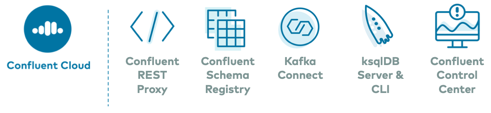

  
* [Build Your Own](#build-your-own)
  * [cp-all-in-one-cloud](cp-all-in-one-cloud)
  * [cp-all-in-one](cp-all-in-one)
  * [cp-all-in-one-community](cp-all-in-one-community)
* [Additional Resources](#additional-resources)

# Build Your Own

We have several resources that launch Apache Kafka® and Confluent Platform with no pre-configured connectors, data sources, topics, schemas, etc.
These examples are useful if you want to build your own custom demo or test environment.
Using these as a foundation, you can add any connectors or applications.

## cp-all-in-one-cloud

[cp-all-in-one-cloud](cp-all-in-one-cloud/README.md): Use this with Confluent Cloud, optionally in conjunction with [ccloud-stack](https://docs.confluent.io/current/tutorials/examples/ccloud/docs/ccloud-stack.html?utm_source=github&utm_medium=demo&utm_campaign=ch.examples_type.community_content.cp-all-in-one) to quickly create new Confluent Cloud environments. This Docker Compose file launches all services in Confluent Platform (except for the Kafka brokers), runs them in containers in your local host, and automatically configures them to connect to Confluent Cloud.

The first 20 users to sign up for [Confluent Cloud](https://www.confluent.io/confluent-cloud/?utm_source=github&utm_medium=demo&utm_campaign=ch.cp-all-in-one_type.community_content.cp-all-in-one-cloud) and use promo code ``C50INTEG`` will receive an additional $50 free usage ([details](https://www.confluent.io/confluent-cloud-promo-disclaimer/?utm_source=github&utm_medium=demo&utm_campaign=ch.cp-all-in-one_type.community_content.cp-all-in-one-cloud)).

## cp-all-in-one

[cp-all-in-one](cp-all-in-one/README.md): This Docker Compose file launches all services in Confluent Platform, and runs them in containers in your local host.

## cp-all-in-one-community

[cp-all-in-one-community](cp-all-in-one-community/README.md): This Docker Compose file launches only the community services in Confluent Platform, and runs them in containers in your local host.

# Additional Resources

* To see these specific `cp-all-in-one` Docker Compose files in action, see the automated demos in https://github.com/confluentinc/examples/tree/latest/cp-quickstart . There is one automated demo for each of the above Docker Compose files.

* [confluentinc/examples](https://github.com/confluentinc/examples): curated list of end-to-end demos that showcase Apache Kafka® event stream processing on the Confluent Platform, an event stream processing platform that enables you to process, organize, and manage massive amounts of streaming data across cloud, on-prem, and serverless deployments.

* [ccloud-stack](https://docs.confluent.io/current/tutorials/examples/ccloud/docs/ccloud-stack.html?utm_source=github&utm_medium=demo&utm_campaign=ch.examples_type.community_content.cp-all-in-one): creates a stack of fully managed services in Confluent Cloud. It is a quick way to create fully managed components in Confluent Cloud, along with a service account, credentials, and ACLs, which you can then use for learning and building other demos.

* [Generate test data](https://www.confluent.io/blog/easy-ways-generate-test-data-kafka?utm_source=github&utm_medium=demo&utm_campaign=ch.cp-all-in-one_type.community_content.top): "Hello, World!" for launching Confluent Platform, plus different ways to generate more interesting test data for your topics
