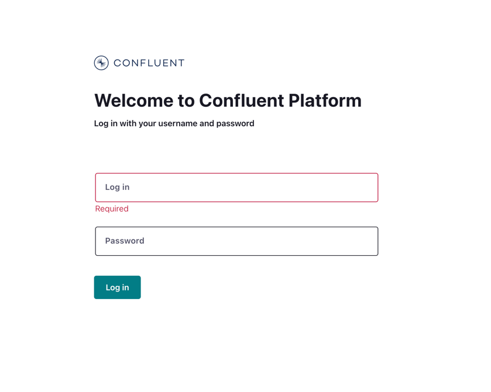
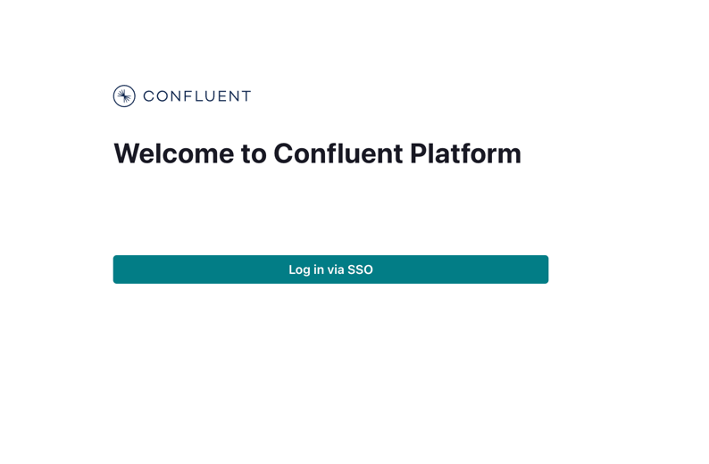

## Hand-on Lab - “Fix Me 😟”
Goal of this exercise is to fix some issues in the docker setup so that we :-   
Should be able to get cp cluster up and running.  
Should be able to produce and consume from broker terminal.  
Should be able to log in to C3 using SSO flow.

### Setup
This demo is configured to work with local keycloak as well as hosted dev-okta. 
However, for this exercise we will use local keycloak settings. As this is faster and gives more flexibility to play around with IDP settings if needed.

### Steps
* Clone the git repository cp-all-in-one
* Checkout the branch **fix-me**
* Navigate to cp-all-in-one-security/oauth
* Ensure you have access to internal docker registry server on aws
```shell
granted sso login --sso-start-url https://d-926757b88b.awsapps.com/start --sso-region us-west-2
aws --profile 519856050701/developer --region us-west-2 ecr get-login-password | docker login --username AWS --password-stdin 519856050701.dkr.ecr.us-west-2.amazonaws.com/docker/prod/confluentinc/
export DOCKER_REGISTRY=519856050701.dkr.ecr.us-west-2.amazonaws.com/docker/prod/
```

Once ready with above steps, we can get started.  
Try to boot the cluster up by script `./start.sh`  
This script creates some pre-requisites files and starts the docker containers. 

### Cheatsheet
* If you need reference, you can always checkout the branch **oauth-ga-examples** in the same repo, where all configurations are correct.  
* The IDP, users and groups information you should be able to find and fix  in **./helper/env.sh**  
* The misconfigurations in CP services can be fixed in **docker-compose.yml**  
* Kafka client properties file gets dynamically configured in the **configs** directory. This directory is mounted to /etc/confluent/configs in the container.  
* If you just want to reassign permissions you can use command `source ./helper/env.sh; source ./helper/functions.sh; assign_role_bindings`  
* Get the logs of any service `docker logs -f <container-name>`

***
***
## Let's roll
 
1. Once you run the script `./start.sh`, you can use the command `docker ps` to get the status of containers. At this stage, you may see all containers in Excited state.  
If you logs of Broker, you may find something like below before it triggered the Broker Shutdown.
```
[2024-06-14 18:36:59,403] WARN KafkaHttpServer transitioned from STARTING to FAILED.: LDAP authentication requested, but no authenticationCallback provided. (io.confluent.http.server.KafkaHttpServerImpl)
java.lang.IllegalStateException: LDAP authentication requested, but no authenticationCallback provided
        at io.confluent.rbacapi.app.RbacApiApplication.getBackingLoginService(RbacApiApplication.java:663)
        at io.confluent.rbacapi.app.RbacApiApplication.configureSecurityHandler(RbacApiApplication.java:627)
        at io.confluent.rest.Application.configureHandler(Application.java:350)
        at io.confluent.rest.ApplicationServer.doStart(ApplicationServer.java:228)
        at org.eclipse.jetty.util.component.AbstractLifeCycle.start(AbstractLifeCycle.java:73)
        at io.confluent.http.server.KafkaHttpServerImpl.doStart(KafkaHttpServerImpl.java:111)
        at java.base/java.lang.Thread.run(Thread.java:840)

```
In this setup, we are enabling MDS. Which looks for some user store and default store so far is LDAP.  
However, for this exercice, we want IDP to be user store for cluster.  
> **Fix it**  
> In docker compose file, add or uncomment the property `KAFKA_CONFLUENT_METADATA_SERVER_USER_STORE: OAUTH`. 

***

2. You can re-run the statrup script `./start.sh` or can incrementally try to start the broker. 
```shell
docker rm $(docker stop broker)
docker-compose up -d broker
```
This time, it would move forward and the broker should start now.   
However, if you look at the broker logs you may find it flooded with below errors.
```
was encountered reading the token endpoint response; will not attempt further retries
        at org.apache.kafka.common.security.oauthbearer.internals.secured.HttpAccessTokenRetriever.handleOutput(HttpAccessTokenRetriever.java:286)
        at org.apache.kafka.common.security.oauthbearer.internals.secured.HttpAccessTokenRetriever.post(HttpAccessTokenRetriever.java:194)
        at org.apache.kafka.common.security.oauthbearer.internals.secured.HttpAccessTokenRetriever.lambda$retrieve$0(HttpAccessTokenRetriever.java:169)
        at org.apache.kafka.common.security.oauthbearer.internals.secured.Retry.execute(Retry.java:70)
        at org.apache.kafka.common.security.oauthbearer.internals.secured.HttpAccessTokenRetriever.retrieve(HttpAccessTokenRetriever.java:160)
        ... 8 more
Caused by: java.io.IOException: The response code 400 and error response 
```
Looking at the exception, it seems that  the broker is trying to get/refresh the JavaWebKeys from configured IDP server, but its getting 400 (bad url).   
Let's check the urls published by the IDP at http://localhost:8080/realms/cp/.well-known/openid-configuration.   

>**Fix it**   
>In env.sh file, update the value of `IDP_JWKS_ENDPOINT` with `jwks_uri` from above response.  
***

3. Once configuration is updated, we will try to restart the broker again with command mentioned in last step.  
>You can avoid purging the container, in that case the logs would be accumulated with previous runs. It may be difficult to isolate the new issue. 

```
[2024-06-14 19:05:55,564] WARN handleOutput - error retrieving data (org.apache.kafka.common.security.oauthbearer.internals.secured.HttpAccessTokenRetriever)
java.io.IOException: Server returned HTTP response code: 400 for URL: http://keycloak:8080/realms/cp/protocol/openid-connect/auth
        at java.base/jdk.internal.reflect.GeneratedConstructorAccessor41.newInstance(Unknown Source)
        at java.base/jdk.internal.reflect.DelegatingConstructorAccessorImpl.newInstance(DelegatingConstructorAccessorImpl.java:45)
        at java.base/java.lang.reflect.Constructor.newInstanceWithCaller(Constructor.java:499)
        at java.base/java.lang.reflect.Constructor.newInstance(Constructor.java:480)
        at java.base/sun.net.www.protocol.http.HttpURLConnection$10.run(HttpURLConnection.java:2092)
        at java.base/sun.net.www.protocol.http.HttpURLConnection$10.run(HttpURLConnection.java:2087)
        at java.base/java.security.AccessController.doPrivileged(AccessController.java:569)
        at java.base/sun.net.www.protocol.http.HttpURLConnection.getChainedException(HttpURLConnection.java:2086)
        at java.base/sun.net.www.protocol.http.HttpURLConnection.getInputStream0(HttpURLConnection.java:1634)
        at java.base/sun.net.www.protocol.http.HttpURLConnection.getInputStream(HttpURLConnection.java:1614)
        at org.apache.kafka.common.security.oauthbearer.internals.secured.HttpAccessTokenRetriever.handleOutput(HttpAccessTokenRetriever.java:252)
        at org.apache.kafka.common.security.oauthbearer.internals.secured.HttpAccessTokenRetriever.post(HttpAccessTokenRetriever.java:194)
        at org.apache.kafka.common.security.oauthbearer.internals.secured.HttpAccessTokenRetriever.lambda$retrieve$0(HttpAccessTokenRetriever.java:169)
        at org.apache.kafka.common.security.oauthbearer.internals.secured.Retry.execute(Retry.java:70)
        at org.apache.kafka.common.security.oauthbearer.internals.secured.HttpAccessTokenRetriever.retrieve(HttpAccessTokenRetriever.java:160)
        at io.confluent.security.auth.client.oauth.RefreshingAccessTokenRetriever.retrieve(RefreshingAccessTokenRetriever.java:40)
        at io.confluent.security.auth.client.provider.HttpOauthBearerCredentialProvider.getCredentials(HttpOauthBearerCredentialProvider.java:31)
        at io.confluent.security.auth.client.rest.RestRequest.configureConnection(RestRequest.java:54)
        at io.confluent.security.auth.client.rest.RestClient$HTTPRequestSender.lambda$submit$0(RestClient.java:408)
        at java.base/java.util.concurrent.FutureTask.run(FutureTask.java:264)
        at java.base/java.util.concurrent.ThreadPoolExecutor.runWorker(ThreadPoolExecutor.java:1136)
        at java.base/java.util.concurrent.ThreadPoolExecutor$Worker.run(ThreadPoolExecutor.java:635)
        at java.base/java.lang.Thread.run(Thread.java:840)

```
The class `HttpAccessTokenRetriever` retrieves token from IDP based on the configured Client Credentials and Token Endpoint. 
Since we are seeing 400, that indicates something wrong with the token end point. 
>**Fix it**   
>In env.sh file, update the value of `IDP_TOKEN_ENDPOINT` with  appropriate value from well known IDP url's reponse 
***


4. Once done above changes, lets try to start the Broker.  
Since we have made the changes in variables, we have to ensure that new variables are available in the terminal.   
    ```shell
    source ./helper/env.sh
    docker rm $(docker stop broker)
    docker-compose up -d broker
    docker logs -f broker
    ```

In broker logs, you may see exceptions like- 
```
[2024-06-14 19:20:00,814] WARN handleOutput - error retrieving data (org.apache.kafka.common.security.oauthbearer.internals.secured.HttpAccessTokenRetriever)
java.io.IOException: Server returned HTTP response code: 401 for URL: http://keycloak:8080/realms/cp/protocol/openid-connect/token
        at java.base/jdk.internal.reflect.GeneratedConstructorAccessor35.newInstance(Unknown Source)
        at java.base/jdk.internal.reflect.DelegatingConstructorAccessorImpl.newInstance(DelegatingConstructorAccessorImpl.java:45)
        at java.base/java.lang.reflect.Constructor.newInstanceWithCaller(Constructor.java:499)
        at java.base/java.lang.reflect.Constructor.newInstance(Constructor.java:480)
        at java.base/sun.net.www.protocol.http.HttpURLConnection$10.run(HttpURLConnection.java:2092)
        at java.base/sun.net.www.protocol.http.HttpURLConnection$10.run(HttpURLConnection.java:2087)
        at java.base/java.security.AccessController.doPrivileged(AccessController.java:569)
        at java.base/sun.net.www.protocol.http.HttpURLConnection.getChainedException(HttpURLConnection.java:2086)
        at java.base/sun.net.www.protocol.http.HttpURLConnection.getInputStream0(HttpURLConnection.java:1634)
        at java.base/sun.net.www.protocol.http.HttpURLConnection.getInputStream(HttpURLConnection.java:1614)
        at org.apache.kafka.common.security.oauthbearer.internals.secured.HttpAccessTokenRetriever.handleOutput(HttpAccessTokenRetriever.java:252)
        at org.apache.kafka.common.security.oauthbearer.internals.secured.HttpAccessTokenRetriever.post(HttpAccessTokenRetriever.java:194)
        at org.apache.kafka.common.security.oauthbearer.internals.secured.HttpAccessTokenRetriever.lambda$retrieve$0(HttpAccessTokenRetriever.java:169)
        at org.apache.kafka.common.security.oauthbearer.internals.secured.Retry.execute(Retry.java:70)
        at org.apache.kafka.common.security.oauthbearer.internals.secured.HttpAccessTokenRetriever.retrieve(HttpAccessTokenRetriever.java:160)
        at io.confluent.security.auth.client.oauth.RefreshingAccessTokenRetriever.retrieve(RefreshingAccessTokenRetriever.java:40)
        at io.confluent.security.auth.client.provider.HttpOauthBearerCredentialProvider.getCredentials(HttpOauthBearerCredentialProvider.java:31)
        at io.confluent.security.auth.client.rest.RestRequest.configureConnection(RestRequest.java:54)
        at io.confluent.security.auth.client.rest.RestClient$HTTPRequestSender.lambda$submit$0(RestClient.java:408)
        at java.base/java.util.concurrent.FutureTask.run(FutureTask.java:264)
        at java.base/java.util.concurrent.ThreadPoolExecutor.runWorker(ThreadPoolExecutor.java:1136)
        at java.base/java.util.concurrent.ThreadPoolExecutor$Worker.run(ThreadPoolExecutor.java:635)
        at java.base/java.lang.Thread.run(Thread.java:840)
Caused by: java.io.IOException: Server returned HTTP response code: 401 for URL: http://keycloak:8080/realms/cp/protocol/openid-connect/token
        at java.base/sun.net.www.protocol.http.HttpURLConnection.getInputStream0(HttpURLConnection.java:2035)
        at java.base/sun.net.www.protocol.http.HttpURLConnection.getInputStream(HttpURLConnection.java:1614)
        at java.base/java.net.HttpURLConnection.getResponseCode(HttpURLConnection.java:529)
        at org.apache.kafka.common.security.oauthbearer.internals.secured.HttpAccessTokenRetriever.handleOutput(HttpAccessTokenRetriever.java:240)
        ... 12 more
[2024-06-14 19:20:00,815] WARN handleOutput - error response code: 401, error response body: {"unauthorized_client" - "Invalid client or Invalid client credentials"} (org.apache.kafka.common.security.oauthbearer.internals.secured.HttpAccessTokenRetriever)
[2024-06-14 19:20:00,815] ERROR Unexpected exception sending HTTP Request. (io.confluent.security.auth.client.rest.RestClient)
org.apache.kafka.common.KafkaException: org.apache.kafka.common.security.oauthbearer.internals.secured.UnretryableException: java.io.IOException: The response code 401 and error response {"unauthorized_client" - "Invalid client or Invalid client credentials"} was encountered reading the token endpoint response; will not attempt further retries
```
This exception very clearly says about "unauthorized_client". If we see the stack trace, it's originating from `io.confluent.security.auth.client.rest.RestClient`  
In this case, the embedded kafka proxy is trying to connect to broker which is configured on OAUTHBEARER.   
We are seeing 401 for the URL `http://keycloak:8080/realms/cp/protocol/openid-connect/token`. Which means that the OAuth Client is requesting for token from IDP, but it's getting Unauthorized exception. This indicates some issue with client ID or Secret. 
>**Fix it**   
>In env.sh file, add or update `export RP_CLIENT_SECRET=rp_client_app_secret`
***

5.  Once above changes are done, we will try to bring the broker up again. 
    ```shell
    source ./helper/env.sh
    docker rm $(docker stop broker)
    docker-compose up -d broker
    docker logs -f broker
    ```
You may see some error around schema registry connection exception. This is ok as we have not brought up Schema registry yet. 
Apart from that we see that you should see that Kafka is up and running.

6. As a next step, we need to add role bindings, before we can proceed for other services. 
For complete list of role bindings, you can refer to file ./helpers/function.sh
    ```shell
    source ./helper/env.sh
    source ./helper/functions.sh
    assign_role_bindings
    ```
We use existing RBAC Apis, so there isn't anything new here. All response should be 204.  
At this stage.  
>Broker is up running  
>MDS is up running   
>Kafka Proxy is up running

***
***
7. Next we will try to bring **Schema Registry** service 

```shell
docker-compose up -d  schema-registry
docker logs -f schema-registry
```

You may see exceptions like 
```
Caused by: org.apache.kafka.common.KafkaException: Failed to create new NetworkClient
        at org.apache.kafka.clients.ClientUtils.createNetworkClient(ClientUtils.java:252)
        at org.apache.kafka.clients.ClientUtils.createNetworkClient(ClientUtils.java:189)
        at org.apache.kafka.clients.admin.KafkaAdminClient.createInternal(KafkaAdminClient.java:525)
        ... 4 more
Caused by: org.apache.kafka.common.KafkaException: java.lang.IllegalArgumentException: Unexpected SASL mechanism: GSSAPI
        at org.apache.kafka.common.network.SaslChannelBuilder.configure(SaslChannelBuilder.java:184)
        at org.apache.kafka.common.network.ChannelBuilders.create(ChannelBuilders.java:192)
        at org.apache.kafka.common.network.ChannelBuilders.clientChannelBuilder(ChannelBuilders.java:81)
        at org.apache.kafka.clients.ClientUtils.createChannelBuilder(ClientUtils.java:119)
        at org.apache.kafka.clients.ClientUtils.createNetworkClient(ClientUtils.java:223)
        ... 6 more
Caused by: java.lang.IllegalArgumentException: Unexpected SASL mechanism: GSSAPI
        at org.apache.kafka.common.security.oauthbearer.internals.secured.JaasOptionsUtils.validateOAuthMechanismAndNonNullJaasConfig(JaasOptionsUtils.java:62)
        at org.apache.kafka.common.security.oauthbearer.internals.secured.JaasOptionsUtils.getOptions(JaasOptionsUtils.java:53)
        at org.apache.kafka.common.security.oauthbearer.OAuthBearerLoginCallbackHandler.configure(OAuthBearerLoginCallbackHandler.java:188)
        at org.apache.kafka.common.security.authenticator.LoginManager.<init>(LoginManager.java:60)
        at org.apache.kafka.common.security.authenticator.LoginManager.acquireLoginManager(LoginManager.java:105)

```
These exceptions are thrown while creating the kafka client where with GSSAPI as SASL mechanism.   
This indicates that we don't have correct authentication mechanism configured in Schema registry to connect to Kafka. 
In this exercise, SR is configured to use Kafka listener configured with OAUTHBEARER. 
>**Fix it**   
>Add or uncomment line `SCHEMA_REGISTRY_KAFKASTORE_SASL_MECHANISM: 'OAUTHBEARER'`
***


9. Once done, Lets try to restart the Schema Registry. 
```shell
docker-compose up -d  schema-registry
docker logs -f schema-registry
```
In SR logs, you may see errors like 
```
org.apache.kafka.common.errors.SaslAuthenticationException: {"status":"invalid_token"}
[2024-06-15 10:45:50,496] INFO Expected 1 brokers but found only 0. Trying to query Kafka for metadata again ... (io.confluent.admin.utils.ClusterStatus)
[2024-06-15 10:45:50,497] ERROR Error while getting broker list. (io.confluent.admin.utils.ClusterStatus)
java.util.concurrent.ExecutionException: org.apache.kafka.common.errors.SaslAuthenticationException: {"status":"invalid_token"}
        at java.base/java.util.concurrent.CompletableFuture.reportGet(CompletableFuture.java:396)
        at java.base/java.util.concurrent.CompletableFuture.get(CompletableFuture.java:2073)
        at org.apache.kafka.common.internals.KafkaFutureImpl.get(KafkaFutureImpl.java:165)
        at io.confluent.admin.utils.ClusterStatus.isKafkaReady(ClusterStatus.java:147)
        at io.confluent.admin.utils.cli.KafkaReadyCommand.main(KafkaReadyCommand.java:149)
Caused by: org.apache.kafka.common.errors.SaslAuthenticationException: {"status":"invalid_token"}
[2024-06-15 10:45:51,007] INFO [AdminClient clientId=adminclient-1] Failed authentication with broker/172.21.0.3 (channelId=-1) ({"status":"invalid_token"}) (org.apache.kafka.common.network.Selector)

```
Looking at the logs, it seems Schema Registry is able to connect to Kafka, however not able to Authenticate. 
The broker is not able to validate the token.
* Check if Kafka client in Schema Registry is getting a valid token.
You can generate the Kafka Client token from IDP and manually see the fields and values. 
```shell
curl -s \
    -d "client_id=$SR_CLIENT_ID" \
    -d "client_secret=$SR_CLIENT_SECRET" \
    -d "grant_type=client_credentials" \
    $IDP_TOKEN_ENDPOINT | jq -r .access_token
```

Analyse the token to some jwt analyser like http://jwt.io. You can look at some important fields like   

| Field  | Description |
|--------| --- |
| iss    | We set this value as expected issuer in our configurations|
| exp    | Expire time of the token|
| aud    | We set this vlaue as expected Audience in our configurations|
| sub    | This is subject sent by IDP. By default we use this filed to extract he principal. However, this can be overridden to some other value. In this example we are using `clientId` for all principal extraction| 
| groups | List of string of wihch the given application is part of. These groups are used to check the Group based authentication in MDS|

```json
{
  "exp": 1718452429,
  "iat": 1718448829,
  "jti": "398a09f6-5882-4a87-9ba8-5c046e6ddbf5",
  "iss": "http://keycloak:8080/realms/cp",
  "aud": "account",
  "sub": "e5172ec0-25d6-4684-8614-f2adb23c529d",
  "typ": "Bearer",
  "azp": "sr_client_app",
  "acr": "1",
  "realm_access": {
    "roles": [
      "offline_access",
      "default-roles-cp",
      "uma_authorization"
    ]
  },
  "resource_access": {
    "${clientId}": {
      "roles": [
        "manage-account",
        "manage-account-links",
        "view-profile"
      ]
    }
  },
  "scope": "profile email",
  "clientId": "sr_client_app",
  "email_verified": false,
  "clientHost": "172.21.0.1",
  "groups": [
    "/app_group1"
  ],
  "preferred_username": "service-account-sr_client_app",
  "clientAddress": "172.21.0.1"
}
```

Once we are satisfied with the values of token, we look for the kafka configuration to validate the token.
Token validation logic in Kafka is implemented via a callback handler name `org.apache.kafka.common.security.oauthbearer.secured.OAuthBearerLoginCallbackHandler`
in CP 7.7 we have added another handler named `io.confluent.kafka.server.plugins.auth.token.CompositeBearerValidatorCallbackHandler` 
Which combines the open sourced `OAuthBearerLoginCallbackHandler` and our properietery `TokenBearerValidatorCallbackHandler`. 
Having this configured helps in upgrade use cases where LDAP and OAuth can co-exist for some.
>**Fix it**   
>add or uncomment `KAFKA_LISTENER_NAME_EXTERNAL_OAUTHBEARER_SASL_SERVER_CALLBACK_HANDLER_CLASS: io.confluent.kafka.server.plugins.auth.token.CompositeBearerValidatorCallbackHandler`
***

10. Let's restart the Schema Registry after configuration update. At this stage, we may face exception like 
```
[2024-06-15 11:06:55,182] INFO [Principal=:e5172ec0-25d6-4684-8614-f2adb23c529d]: Expiring credential re-login thread has been interrupted and will exit. (org.apache.kafka.common.security.oauthbearer.internals.expiring.ExpiringCredentialRefreshingLogin)
[2024-06-15 11:06:55,183] ERROR Error starting the schema registry (io.confluent.kafka.schemaregistry.rest.SchemaRegistryRestApplication)
io.confluent.kafka.schemaregistry.exceptions.SchemaRegistryInitializationException: Error initializing kafka store while initializing schema registry
        at io.confluent.kafka.schemaregistry.storage.KafkaSchemaRegistry.init(KafkaSchemaRegistry.java:403)
        at io.confluent.kafka.schemaregistry.rest.SchemaRegistryRestApplication.initSchemaRegistry(SchemaRegistryRestApplication.java:79)
        at io.confluent.kafka.schemaregistry.rest.SchemaRegistryRestApplication.configureBaseApplication(SchemaRegistryRestApplication.java:105)
        at io.confluent.rest.Application.configureHandler(Application.java:324)
        at io.confluent.rest.ApplicationServer.doStart(ApplicationServer.java:233)
        at org.eclipse.jetty.util.component.AbstractLifeCycle.start(AbstractLifeCycle.java:73)
        at io.confluent.kafka.schemaregistry.rest.SchemaRegistryMain.main(SchemaRegistryMain.java:44)
Caused by: io.confluent.kafka.schemaregistry.storage.exceptions.StoreInitializationException: Failed trying to create or validate schema topic configuration
        at io.confluent.kafka.schemaregistry.storage.KafkaStore.createOrVerifySchemaTopic(KafkaStore.java:191)
        at io.confluent.kafka.schemaregistry.storage.KafkaStore.init(KafkaStore.java:121)
        at io.confluent.kafka.schemaregistry.storage.KafkaSchemaRegistry.init(KafkaSchemaRegistry.java:401)
        ... 6 more
Caused by: java.util.concurrent.ExecutionException: org.apache.kafka.common.errors.TopicAuthorizationException: Authorization failed.
        at java.base/java.util.concurrent.CompletableFuture.reportGet(CompletableFuture.java:396)
        at java.base/java.util.concurrent.CompletableFuture.get(CompletableFuture.java:2096)
        at org.apache.kafka.common.internals.KafkaFutureImpl.get(KafkaFutureImpl.java:180)
        at io.confluent.kafka.schemaregistry.storage.KafkaStore.createSchemaTopic(KafkaStore.java:230)
        at io.confluent.kafka.schemaregistry.storage.KafkaStore.createOrVerifySchemaTopic(KafkaStore.java:183)
        ... 8 more
Caused by: org.apache.kafka.common.errors.TopicAuthorizationException: Authorization failed.

```
Good news is Schema Registry is now able to connect to Kafka on OAUTHBEARER listener and able to authenticate with IDP token.   
The new exception indicates that Schema Registry is not authorised to use some topic. At this point of time, we enable DEBUG level in kafka
and see the details of the Authorization request which contains the Resource and Principal as well.   
Though we have added all Role bindings for Schema Registry. Let's revisit...   
If we look at the function `assign_sr_role_bindings` in function.sh we have assigned roles to $SR_CLIENT_ID (sr_client_app) as **SystemAdmin** along with some topic level access.   
If we see the exception, the principal that is getting denied operation is `Principal=:e5172ec0-25d6-4684-8614-f2adb23c529d`  
This indicates that the field that we wanted to use as principal extraction is not configured appropriately.  
Kafka as an OAuth server is processing the token and extracting the fields. So this has to be fixed in Kafka side.  
In Broker configuration we have `KAFKA_LISTENER_NAME_EXTERNAL_SASL_OAUTHBEARER_SUB_CLAIM_NAME: $SUB_CLAIM_NAME`, However, in our env.sh file, the value of SUB_CLAIM_NAME is `sub`
This is forcing kafka to pick up the wrong field for principal extraction. let's fix that.
>**Fix it**   
>in env.sh file, Update the value of SUB_CLAIM_NAME to `clientId`
***

11. Since this change is in Kafka Server, we need to restart the broker followed by Schema Registry. 
```shell
docker rm $(docker stop broker)
./start.sh  # This will take care of broker startup and role bindings
docker logs -f schema-registry
```

```
[2024-06-15 11:40:33,568] INFO Started @9096ms (org.eclipse.jetty.server.Server)
[2024-06-15 11:40:33,569] INFO Schema Registry version: 7.7.0-0 commitId: a281fd2e973c9e0eee5fd3e14f89aa9d68587177 (io.confluent.kafka.schemaregistry.rest.SchemaRegistryMain)
[2024-06-15 11:40:33,569] INFO Server started, listening for requests... (io.confluent.kafka.schemaregistry.rest.SchemaRegistryMain)
```

12. Great, we have our Schema Registry server running. We will do some quick check to ensure all services are good and able to
accept OAuth tokens.  
Let's generate a client token and try to access an API end point in SR.

```shell
export SUPER_USER_ACCESS_TOKEN=$(curl -s \
    -d "client_id=$SUPERUSER_CLIENT_ID" \
    -d "client_secret=$SUPERUSER_CLIENT_SECRET" \
    -d "grant_type=client_credentials" \
    $IDP_TOKEN_ENDPOINT | jq -r .access_token)
    
    curl -H "Authorization: Bearer $SUPER_USER_ACCESS_TOKEN" http://schema-registry:8081/schemas/types/
```

You may see error 
```shell
{"error_code":500,"message":"Internal Server Error"}
```

If you see the Schema Registry server logs, you may see 

```shell
[2024-06-16 08:18:30,420] ERROR Request Failed with exception  (io.confluent.rest.exceptions.DebuggableExceptionMapper)
java.lang.NullPointerException: Cannot invoke "java.security.Principal.getName()" because "principal" is null
        at io.confluent.kafka.schemaregistry.security.authorizer.AbstractSchemaRegistryAuthorizer.authorize(AbstractSchemaRegistryAuthorizer.java:50)
        at io.confluent.kafka.schemaregistry.security.filter.AuthorizationFilter.filter(AuthorizationFilter.java:365)
        at org.glassfish.jersey.server.ContainerFilteringStage.apply(ContainerFilteringStage.java:108)
        at org.glassfish.jersey.server.ContainerFilteringStage.apply(ContainerFilteringStage.java:44)
        at org.glassfish.jersey.process.internal.Stages.process(Stages.java:173)
        at org.glassfish.jersey.server.ServerRuntime$1.run(ServerRuntime.java:247)
        at org.glassfish.jersey.internal.Errors$1.call(Errors.java:248)
        at org.glassfish.jersey.internal.Errors$1.call(Errors.java:244)
        at org.glassfish.jersey.internal.Errors.process(Errors.java:292)
        at org.glassfish.jersey.internal.Errors.process(Errors.java:274)
        at org.glassfish.jersey.internal.Errors.process(Errors.java:244)
        at org.glassfish.jersey.process.internal.RequestScope.runInScope(RequestScope.java:265)
        at org.glassfish.jersey.server.ServerRuntime.process(ServerRuntime.java:234)
        at org.glassfish.jersey.server.ApplicationHandler.handle(ApplicationHandler.java:684)
        at org.glassfish.jersey.servlet.WebComponent.serviceImpl(WebComponent.java:394)
        at org.glassfish.jersey.servlet.ServletContainer.serviceImpl(ServletContainer.java:378)
        at org.glassfish.jersey.servlet.ServletContainer.doFilter(ServletContainer.java:553)
        at org.glassfish.jersey.servlet.ServletContainer.doFilter(ServletContainer.java:494)
        at org.glassfish.jersey.servlet.ServletContainer.doFilter(ServletContainer.java:431)
        at org.eclipse.jetty.servlet.FilterHolder.doFilter(FilterHolder.java:193)
        at org.eclipse.jetty.servlet.ServletHandler$Chain.doFilter(ServletHandler.java:1626)
        at io.confluent.rest.metrics.JettyRequestMetricsFilter.doFilter(JettyRequestMetricsFilter.java:84)
        at org.eclipse.jetty.servlet.FilterHolder.doFilter(FilterHolder.java:193)
        at org.eclipse.jetty.servlet.ServletHandler$Chain.doFilter(ServletHandler.java:1626)
        at org.eclipse.jetty.servlet.ServletHandler.doHandle(ServletHandler.java:552)
        at org.eclipse.jetty.server.handler.ScopedHandler.nextHandle(ScopedHandler.java:233)
        at org.eclipse.jetty.server.session.SessionHandler.doHandle(SessionHandler.java:1624)
        at org.eclipse.jetty.server.handler.ScopedHandler.handle(ScopedHandler.java:143)
        at org.eclipse.jetty.server.handler.RequestLogHandler.handle(RequestLogHandler.java:54)
        at org.eclipse.jetty.server.handler.HandlerWrapper.handle(HandlerWrapper.java:127)
        at io.confluent.kafka.schemaregistry.rest.RequestIdHandler.handle(RequestIdHandler.java:51)

```
Looking at the logs, it seems that Schema Registry to trying to authorize a principal whose value is `null`.   
Authorization happens for the principal extracted during the Authentication phase. In this case, it seems the Authentication 
is returning null.   
This indicates us the SR is not able to process the token correctly and returning `null` as the principal.   
In CP 7.7 we have introduced a new Servlet Handler called `AuthenticationHandler` to handle OAuth along with other requests.   
>**Fix it**   
>add or uncomment
`SCHEMA_REGISTRY_REST_SERVLET_INITIALIZOR_CLASSES: io.confluent.common.security.jetty.initializer.AuthenticationHandler`
***

13. Let's restart the Schema Registry after above changes and try to hit the SR end point. 
```shell
docker rm $(docker stop schema-registry)
docker-compose up -d schema-registry
# When the SR is up and running
curl -H "Authorization: Bearer $SUPER_USER_ACCESS_TOKEN" http://schema-registry:8081/schemas/types/
["JSON","PROTOBUF","AVRO"]                                                        
```

**Great Job. Our Kafka and Schema Registry is up and running now.** :tada: :tada: :tada:

***
***

14. As next step, we will try to bring connect. 
    ```shell
    docker-compose up -d connect
    docker logs -f connect
    ```

Connect service should come up without any error.  
Please note: All misconfigurations, error and debug steps that we saw in Schema Registry is application to Connect as well as Rest Proxy.  
These services share the same code and configurations for OAuth.

**Great Job. Our Kafka, Schema Registry and Connect is up and running now.** :tada: :tada: :tada:

***
***

15. As next step, we will try to bring up Confluent Control Center. 
    ```shell
    docker rm $(docker stop control-center) 
    docker-compose up -d control-center
    docker logs -f control-center
    ```

You may see errors like 
```
Caused by: org.apache.kafka.common.errors.IllegalSaslStateException: Unexpected handshake request with client mechanism OAUTHBEARER, enabled mechanisms are []
Expected 1 brokers but found only 0. Trying to query Kafka for metadata again ...
Error while getting broker list.
java.util.concurrent.ExecutionException: org.apache.kafka.common.errors.IllegalSaslStateException: Unexpected handshake request with client mechanism OAUTHBEARER, enabled mechanisms are []
        at java.base/java.util.concurrent.CompletableFuture.reportGet(CompletableFuture.java:396)
        at java.base/java.util.concurrent.CompletableFuture.get(CompletableFuture.java:2073)
        at org.apache.kafka.common.internals.KafkaFutureImpl.get(KafkaFutureImpl.java:165)
        at io.confluent.admin.utils.ClusterStatus.isKafkaReady(ClusterStatus.java:147)
        at io.confluent.admin.utils.cli.KafkaReadyCommand.main(KafkaReadyCommand.java:149)

```
It seems C3 is trying to connect to kafka with OAUTHBEARER but it's not configured on Kafka. However, we have seen that other services were able to connect to kafka with OAuth.   
This means, C3 may be trying to connect to kafka to a listener which is not configured for OAUTHBEARER.  
If we check the kafka configurations, we have configured OAuth on "EXTERNAL" listener which listens on port 9095.  
To fix this issue, update the bootstrap server to correct OAuth listener
>**Fix it**   
> Update the value `CONTROL_CENTER_BOOTSTRAP_SERVERS: EXTERNAL://broker:9092`
***

16. Let's try to restart control center. This time Confluent Control Center should start. Control Center uses the SSO ( Device Authorization ) to enable user login in UI.  
17. Let's try to log in with user `c3user:c3user` to http://localhost:9021  
We  see the screen in Control Center which challenges for Username and Password, this indicates that SSO flow is not configured properly. In SSO, just like okta, the IDP should challenge and validate the credentials. 


The SSO flow gets enabled in C3 with property  `confluent.control.center.auth.sso.mode: oidc`.
Let's look that the Control Center properties. 
>**Fix it**   
> Add or update the line `CONTROL_CENTER_AUTH_SSO_MODE: oidc`

We should also make sure that MDS is also configured to handle SSO requests. `KAFKA_CONFLUENT_METADATA_SERVER_SSO_MODE: oidc`
***

17. Once done, lets restart the Control Center. 
```shell
docker rm $(docker stop control-center) 
docker-compose up -d control-center
docker logs -f control-center

```
Once C3 http service is running, try to naviate to `http://localhost:9021/`
This time, you may see the SSO button on C3. 


18. Now we should be ble to log in to C3 using SSO flow with credentials `c3user:c3user`.    
In a different incognito window, let's try to log in  C3 with another user `c3superuser:c3superuser`.  
With super user, we should be able to see the Kafka cluster and Option to role bindings.

At this stage all CP sevices are up and running and ready for further experiments.  
You can now try to produce/consume and use datagen connector. Examples and commands are given in the main README page.

### Thank You and Good Luck !!

