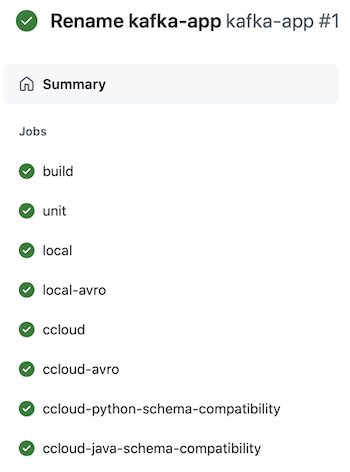
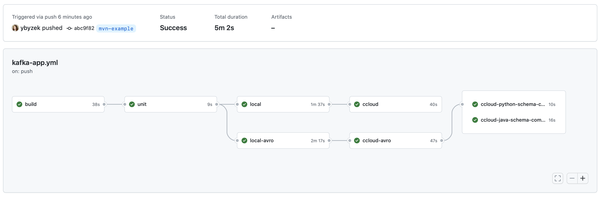

## README

* [Overview](#overview)
* [Instructions](#instructions)
* [Resources](#resources)

## Overview

This demo uses GitHub Actions for developing and valiating Apache Kafka client application, focusing on a Python producer and consumer using Kafka Python Client, plus examples for testing [schema](schemas/) compatibility using both Python and Java.

The code defines an GitHub Actions workflow [kafka-app](.github/workflows/kafka-app.yml) with jobs to demonstrate a few capabilities:

- [build](.github/workflows/kafka-app.yml#L20-L44): Build a Docker image for the [Kafka Python client application](src/)
- [sanity](.github/workflows/kafka-app.yml#L46-L62): Sanity test the app with [rdkafka mock](https://github.com/edenhill/librdkafka/blob/master/src/rdkafka_mock.h)
- [local](.github/workflows/kafka-app.yml#L64-L95): Locally test the app using an action called [cp-all-in-one-action](https://github.com/marketplace/actions/run-kafka-with-confluent-cp-all-in-one) to run Confluent Platform from a [Docker Compose file](https://docs.confluent.io/platform/current/tutorials/build-your-own-demos.html#cp-all-in-one)
- [local-avro](.github/workflows/kafka-app.yml#L97-L128): Locally test the app with Schema Registry and Avro using an action called [cp-all-in-one-action](https://github.com/marketplace/actions/run-kafka-with-confluent-cp-all-in-one) to run Confluent Platform from a [Docker Compose file](https://docs.confluent.io/platform/current/tutorials/build-your-own-demos.html#cp-all-in-one)
- [ccloud](.github/workflows/kafka-app.yml#L130-L160): Test the app to [Confluent Cloud](https://www.confluent.io/confluent-cloud/tryfree-v1/)
- [ccloud-avro](.github/workflows/kafka-app.yml#L162-L192): Test the app to [Confluent Cloud](https://www.confluent.io/confluent-cloud/tryfree-v1/) with Confluent Cloud Schema Registry and Avro
- [ccloud-python-schema-compatibility](.github/workflows/kafka-app.yml#L194-L222): Use [SchemaRegistryClient.test_compatibility()](https://docs.confluent.io/platform/current/clients/confluent-kafka-python/html/_modules/confluent_kafka/schema_registry/schema_registry_client.html) as shown in [src/test_schema_compatibility.py](src/test_schema_compatibility.py) to check a new schema's compatibility to the existing schema in Confluent Cloud Schema Registry (Python)
- [ccloud-java-schema-compatibility](.github/workflows/kafka-app.yml#L224-L253): Use [kafka-schema-registry-maven-plugin](https://docs.confluent.io/platform/current/schema-registry/develop/maven-plugin.html) as shown in the [pom.xml](pom.xml) to check a new schema's compatibility to the existing schema in Confluent Cloud Schema Registry (Java)



## Instructions

1. Provision a Kafka cluster, enable Schema Registry and create an API key and secret on [Confluent Cloud](https://www.confluent.io/confluent-cloud/tryfree-v1/). Use the [quickstart](https://developer.confluent.io/quickstart/kafka-on-confluent-cloud/), [Confluent Terraform Provider](https://registry.terraform.io/providers/confluentinc/confluent/0.9.0), or [ccloud-stack](https://docs.confluent.io/platform/current/tutorials/examples/ccloud/docs/ccloud-stack.html).

2. In your GitHub account, create [Encrypted Secrets](https://docs.github.com/en/actions/security-guides/encrypted-secrets) for your Confluent Cloud cluster and credentials:

```shell
# Confluent Cloud Kafka cluster
CONFLUENT_BOOTSTRAP_SERVERS
CONFLUENT_API_KEY
CONFLUENT_API_SECRET
# Confluent Cloud Schema Registry
CONFLUENT_SCHEMA_REGISTRY_URL
CONFLUENT_BASIC_AUTH_USER_INFO
```

3. Fork this repository and push a change to trigger the [workflow](.github/workflows/kafka-app.yml).



## Resources

- [Confluent Cloud](https://www.confluent.io/confluent-cloud/tryfree-v1/): Cloud-native service for Apache Kafka
- [GitHub Actions for ksqlDB](https://github.com/jzaralim/ksqldb-migrations-action): demonstrates schema migrations upon a ksqlDB cluster running in Confluent Cloud
- [Kafka Python Client](https://docs.confluent.io/kafka-clients/python/current/overview.html)
- [GitHub Actions](https://docs.github.com/en/actions)

